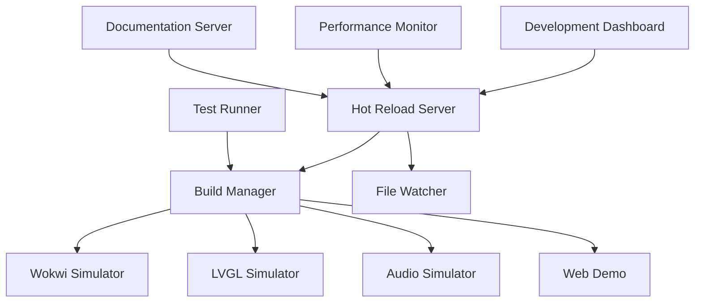
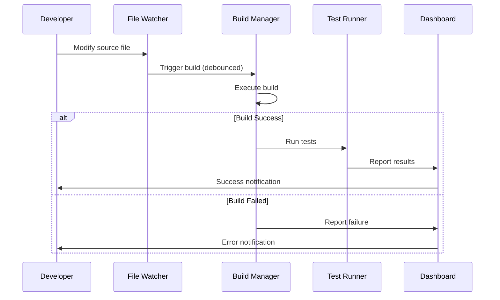

# xtouch Hot-Reload Development Environment

This directory contains a comprehensive hot-reload development environment for the ESP32-2432S028R boombox project, providing automated building, testing, and deployment across all simulation approaches.

## Features

### 🔥 Hot Reload Capabilities
- **File System Monitoring**: Watches for changes across all project files
- **Intelligent Build Triggering**: Debounced builds with component-specific triggers
- **Automated Testing**: Runs relevant tests after successful builds
- **Real-time Notifications**: WebSocket-based live updates to connected clients
- **Build Queuing**: Manages concurrent builds and prevents conflicts

### 🛠 Development Tools
- **Multi-Simulator Support**: Wokwi, LVGL PC, Audio Desktop, and Web Demo
- **Performance Monitoring**: Real-time metrics and resource usage tracking
- **Debug Tools**: Integrated debugging and profiling capabilities
- **Documentation Server**: Live-reloading documentation with MkDocs
- **Development Dashboard**: Web-based interface for monitoring and control

### 🐳 Containerized Environment
- **Docker Compose**: Multi-service development stack
- **Volume Persistence**: Cached builds and dependencies
- **Service Isolation**: Each simulator runs in its own container
- **Network Integration**: Services can communicate seamlessly

## Quick Start

### Prerequisites

#### Docker Environment
```bash
# Install Docker and Docker Compose
sudo apt update
sudo apt install docker.io docker-compose

# Add user to docker group
sudo usermod -aG docker $USER
newgrp docker
```

#### Native Environment
```bash
# System dependencies
sudo apt install build-essential cmake nodejs npm python3-pip

# Python packages
pip3 install watchdog websockets psutil pytest

# Audio development
sudo apt install portaudio19-dev libsndfile1-dev libfftw3-dev
```

### Docker Setup (Recommended)

```bash
# Clone the project
cd /path/to/xtouch

# Start development environment
cd simulation/dev_environment
docker-compose up -d

# Check service status
docker-compose ps

# View logs
docker-compose logs -f xtouch-dev

# Access development container
docker-compose exec xtouch-dev bash
```

### Native Setup

```bash
# Start development server
cd simulation/dev_environment
chmod +x scripts/dev_server.sh
./scripts/dev_server.sh start

# Check status
./scripts/dev_server.sh status

# Stop services
./scripts/dev_server.sh stop
```

## Architecture

### Service Stack



### Component Overview

1. **Hot Reload Server** (`hot_reload.py`)
   - Central coordination service
   - File change detection and debouncing
   - Build queue management
   - WebSocket communication

2. **Build Manager**
   - Component-specific build strategies
   - Parallel build execution
   - Test automation integration
   - Build result tracking

3. **File Watcher**
   - Recursive file system monitoring
   - Pattern-based component mapping
   - Intelligent ignore patterns
   - Debounced change notifications

4. **Development Dashboard**
   - Real-time status monitoring
   - Build history visualization
   - Manual trigger controls
   - Live log streaming

## Configuration

### Environment Variables

```bash
# Core settings
WORKSPACE=/workspace                    # Project root directory
WEBSOCKET_PORT=8765                    # Hot reload server port
BUILD_DELAY=2.0                        # Debounce delay (seconds)

# Wokwi settings
WOKWI_LICENSE_KEY=your_license_key     # Wokwi Pro license (optional)

# Audio settings
PULSE_SERVER=unix:/run/user/1000/pulse/native  # PulseAudio server

# Development mode
NODE_ENV=development                   # Enable dev features
CHOKIDAR_USEPOLLING=true              # File watching (containers)
```

### Watch Patterns

The system monitors different file patterns for each component:

```python
WATCH_PATTERNS = {
    "firmware": [
        "src/**/*.cpp", 
        "src/**/*.c", 
        "src/**/*.h", 
        "platformio.ini"
    ],
    "web_demo": [
        "simulation/web_demo/src/**/*.js",
        "simulation/web_demo/src/**/*.css",
        "simulation/web_demo/*.html"
    ],
    "lvgl_sim": [
        "simulation/lvgl_pc/src/**/*.cpp",
        "simulation/lvgl_pc/CMakeLists.txt"
    ],
    "audio_sim": [
        "simulation/audio_desktop/src/**/*.cpp",
        "simulation/audio_desktop/include/**/*.h"
    ],
    "tests": [
        "simulation/test_scenarios/**/*.py"
    ],
    "docs": [
        "docs/**/*.md", 
        "*.md"
    ]
}
```

### Build Commands

Each component has specific build and test commands:

```python
BUILD_COMMANDS = {
    "firmware": ["pio", "run"],
    "web_demo": ["npm", "run", "build"],
    "lvgl_sim": ["make", "-C", "simulation/lvgl_pc/build"],
    "audio_sim": ["make", "-C", "simulation/audio_desktop/build"],
    "docs": ["mkdocs", "build"]
}

TEST_COMMANDS = {
    "firmware": ["python", "test_framework.py", "--simulators", "wokwi"],
    "lvgl_sim": ["python", "test_framework.py", "--simulators", "lvgl"],
    "audio_sim": ["python", "test_framework.py", "--simulators", "audio"]
}
```

## Development Workflow

### 1. Code-Test-Debug Cycle



### 2. Multi-Component Development

When working on features that span multiple components:

1. **Edit Source Files**: Make changes to any tracked files
2. **Automatic Detection**: File watcher detects changes
3. **Component Mapping**: System determines affected components
4. **Parallel Builds**: Components build in parallel where possible
5. **Integration Testing**: Cross-component tests run automatically
6. **Live Updates**: Connected interfaces update immediately

### 3. Testing Integration

The environment provides multiple testing levels:

- **Unit Tests**: Component-specific automated tests
- **Integration Tests**: Cross-component functionality
- **Performance Tests**: Resource usage and timing
- **End-to-End Tests**: Complete workflow validation

## Services and Ports

### Development Services

| Service | Port | Description | Access URL |
|---------|------|-------------|------------|
| Hot Reload Server | 8765 | WebSocket API | `ws://localhost:8765` |
| Development Dashboard | 8000 | Web interface | `http://localhost:8000/dashboard.html` |
| Web Demo | 3000 | Interactive demo | `http://localhost:3000` |
| LVGL Simulator | 5900 | VNC display | `vnc://localhost:5900` |
| Audio Control API | 8001 | REST API | `http://localhost:8001/api` |
| Documentation | 4000 | MkDocs server | `http://localhost:4000` |
| Monitoring | 9090 | Prometheus metrics | `http://localhost:9090` |
| Grafana | 3003 | Metrics dashboard | `http://localhost:3003` |

### Docker Services

```bash
# View all services
docker-compose ps

# Service logs
docker-compose logs -f [service-name]

# Scale services
docker-compose up -d --scale web-demo=2

# Restart specific service
docker-compose restart xtouch-dev

# Execute commands in service
docker-compose exec xtouch-dev bash
```

## WebSocket API

The hot reload server provides a WebSocket API for real-time communication:

### Client Connection

```javascript
const ws = new WebSocket('ws://localhost:8765');

ws.onopen = function() {
    console.log('Connected to hot reload server');
};

ws.onmessage = function(event) {
    const data = JSON.parse(event.data);
    handleMessage(data);
};
```

### Message Types

#### Server → Client

```javascript
// Build completion notification
{
    "type": "build_complete",
    "component": "firmware",
    "status": "success",
    "duration": 15.7,
    "files_changed": ["src/main.cpp"],
    "tests_passed": true,
    "timestamp": 1640995200
}

// File change notification
{
    "type": "file_change",
    "component": "web_demo",
    "files": ["src/index.js", "src/style.css"],
    "timestamp": 1640995200
}

// Status response
{
    "type": "status_response",
    "current_builds": ["firmware"],
    "build_queue_size": 2,
    "connected_clients": 3,
    "build_history": [...]
}
```

#### Client → Server

```javascript
// Get current status
{
    "type": "get_status"
}

// Trigger manual build
{
    "type": "trigger_build",
    "component": "firmware"
}

// Get build history
{
    "type": "get_build_history"
}
```

## Performance Monitoring

### Metrics Collection

The environment collects various performance metrics:

```python
# Build metrics
build_metrics = {
    "duration": 15.7,           # Build time in seconds
    "success_rate": 0.95,       # Build success rate
    "queue_size": 2,            # Current queue size
    "parallel_builds": 3        # Concurrent builds
}

# Resource metrics
resource_metrics = {
    "cpu_usage": 45.2,          # CPU percentage
    "memory_usage": 512.8,      # Memory in MB
    "disk_io": 15.3,           # Disk I/O rate
    "network_io": 8.9          # Network I/O rate
}

# Test metrics
test_metrics = {
    "test_duration": 25.4,      # Test execution time
    "pass_rate": 0.98,         # Test pass rate
    "coverage": 0.85,          # Code coverage
    "flaky_tests": 2           # Number of flaky tests
}
```

### Prometheus Integration

Metrics are exported to Prometheus for monitoring and alerting:

```yaml
# prometheus.yml
global:
  scrape_interval: 15s

scrape_configs:
  - job_name: 'xtouch-dev'
    static_configs:
      - targets: ['xtouch-dev:9091']
    scrape_interval: 5s
    metrics_path: '/metrics'
```

### Grafana Dashboards

Pre-configured dashboards for:
- **Build Performance**: Build times, success rates, queue depth
- **System Resources**: CPU, memory, disk, network usage
- **Test Results**: Pass rates, duration, coverage trends
- **Development Activity**: File changes, commits, deployments

## Debugging and Troubleshooting

### Common Issues

#### 1. Build Failures
```bash
# Check build logs
docker-compose logs build-watcher

# Manual build testing
docker-compose exec xtouch-dev bash
cd /workspace
pio run

# Check dependencies
pio lib list
```

#### 2. File Watching Issues
```bash
# Check file watcher logs
docker-compose logs -f xtouch-dev | grep "File change"

# Test file watching
echo "test" >> src/main.cpp
# Should trigger build within 2 seconds

# Check inotify limits (Linux)
cat /proc/sys/fs/inotify/max_user_watches
```

#### 3. Service Communication
```bash
# Test WebSocket connection
curl -i -N -H "Connection: Upgrade" \
  -H "Upgrade: websocket" \
  -H "Sec-WebSocket-Key: test" \
  -H "Sec-WebSocket-Version: 13" \
  http://localhost:8765/

# Check service connectivity
docker-compose exec xtouch-dev netstat -tlnp
```

#### 4. Performance Issues
```bash
# Check resource usage
docker stats

# Profile build performance
time docker-compose exec xtouch-dev pio run

# Check disk space
docker system df
docker volume ls
```

### Debug Mode

Enable debug logging for detailed information:

```bash
# Set debug environment
export DEBUG=1
export LOG_LEVEL=DEBUG

# Restart with debug logging
docker-compose down
docker-compose up -d

# View debug logs
docker-compose logs -f --tail=100 xtouch-dev
```

### Log Analysis

```bash
# Real-time log monitoring
tail -f /workspace/hot_reload.log | grep ERROR

# Build performance analysis
grep "Build.*completed" /workspace/hot_reload.log | \
  awk '{print $NF}' | sort -n

# Test result analysis
grep "Test.*:" /workspace/hot_reload.log | \
  awk '{print $4}' | sort | uniq -c
```

## Customization

### Adding New Components

1. **Update Watch Patterns**:
```python
CONFIG["watch_patterns"]["my_component"] = [
    "my_component/**/*.cpp",
    "my_component/**/*.h"
]
```

2. **Define Build Command**:
```python
CONFIG["build_commands"]["my_component"] = [
    "make", "-C", "my_component/build"
]
```

3. **Add Test Command**:
```python
CONFIG["test_commands"]["my_component"] = [
    "python", "-m", "pytest", "my_component/tests/"
]
```

### Custom Build Strategies

```python
class CustomBuildStrategy:
    def __init__(self, component_name):
        self.component = component_name
    
    async def build(self, files_changed):
        # Custom build logic
        if self.should_full_build(files_changed):
            return await self.full_build()
        else:
            return await self.incremental_build(files_changed)
    
    def should_full_build(self, files_changed):
        # Determine if full build is needed
        config_files = ["CMakeLists.txt", "Makefile", "*.ini"]
        return any(f.endswith(ext) for f in files_changed for ext in config_files)
```

### Integration with IDEs

#### VS Code Integration

```json
// .vscode/tasks.json
{
    "version": "2.0.0",
    "tasks": [
        {
            "label": "Start Dev Environment",
            "type": "shell",
            "command": "./simulation/dev_environment/scripts/dev_server.sh",
            "args": ["start"],
            "group": "build",
            "presentation": {
                "echo": true,
                "reveal": "always",
                "focus": false,
                "panel": "new"
            }
        }
    ]
}
```

#### vim/neovim Integration

```lua
-- Hot reload trigger for neovim
vim.api.nvim_create_autocmd("BufWritePost", {
    pattern = {"*.cpp", "*.c", "*.h"},
    callback = function()
        vim.fn.system("curl -X POST http://localhost:8765/trigger_build")
    end
})
```

## Future Enhancements

### Planned Features

1. **Cloud Development**: Remote development environment support
2. **AI-Assisted Debugging**: Automated error analysis and suggestions
3. **Performance Regression Detection**: Automated performance monitoring
4. **Multi-Platform Testing**: Automated testing across different platforms
5. **Deployment Automation**: Automated deployment to test devices

### Extension Points

- **Custom Simulators**: Plugin system for new simulation types
- **Build Plugins**: Custom build strategies and optimizations
- **Notification Channels**: Integration with Slack, Teams, email
- **Metrics Exporters**: Custom metrics collection and analysis
- **Test Frameworks**: Integration with additional testing tools

## Contributing

### Development Guidelines

1. **File Organization**: Keep scripts organized and well-documented
2. **Error Handling**: Implement robust error handling and recovery
3. **Performance**: Monitor and optimize resource usage
4. **Logging**: Provide detailed logging for debugging
5. **Testing**: Write tests for new functionality

### Submitting Changes

1. Test changes in isolated environment
2. Update documentation for new features
3. Ensure backward compatibility
4. Add appropriate logging and error handling
5. Submit pull request with detailed description

## License

This development environment is part of the xtouch project and is licensed under GPL-3.0.